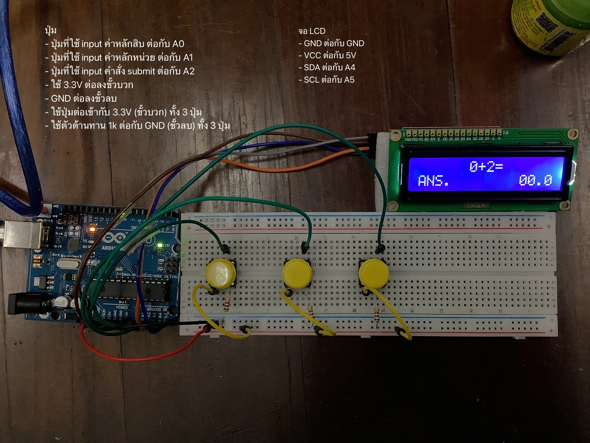

# Simple-Math-Game
- tools:
    1. Breadboard
    2. Arduino Board
    3. LCD I2C
    4. 3 Buttons
    5. 3 1 kΩ resistors
- circuit:

- result: [https://youtu.be/CO5_VvYUaBY](https://youtu.be/CO5_VvYUaBY)
